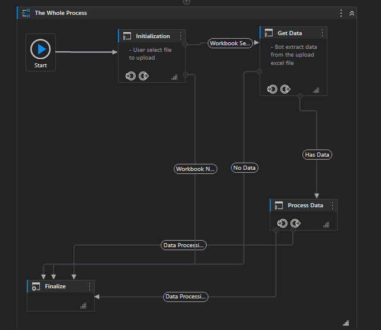
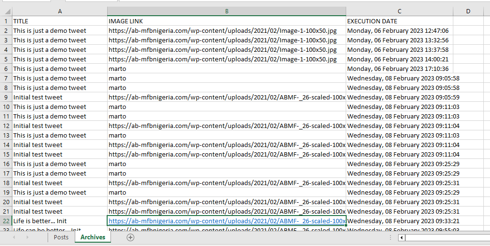

## Tweeter Dispatcher Bot Process Flow
``````
 - This bot get data from the user
 - Process it and adds it to the Orchestrator Queue
 - Proccessed Data would be automatically added to the Archive Sheet in Excel

``````


## Sample Data
[Download Sample Data](https://github.com/geomartins/TweeterDispatcherBot/blob/master/Assets/tweeter_data.xlsx)





